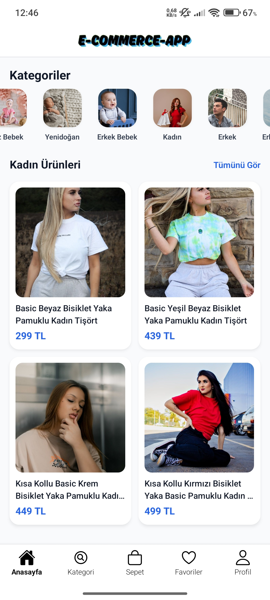
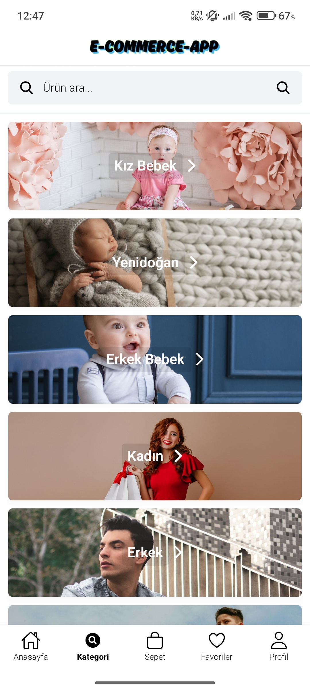
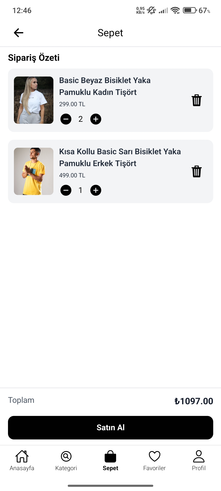
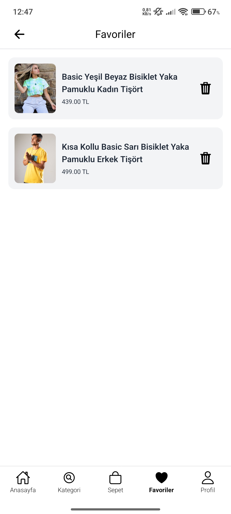
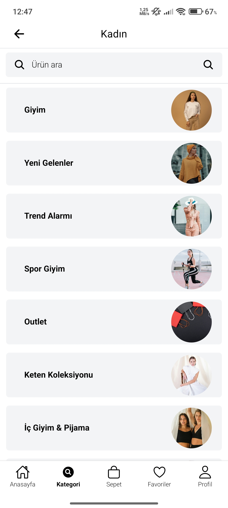
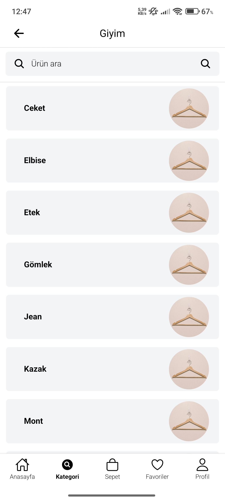
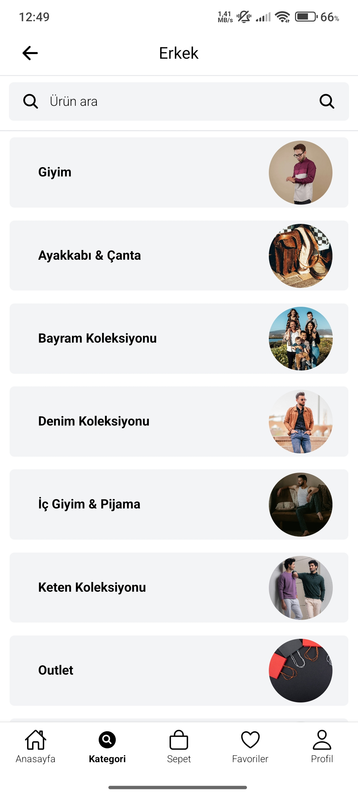
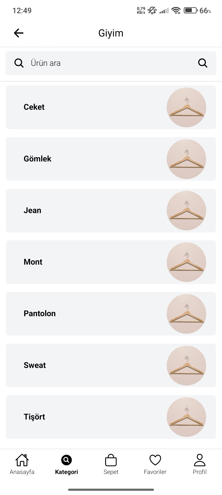

# E-Commerce App 📱👕👟

[](https://opensource.org/licenses/MIT)
[](https://expo.dev)
[](https://reactnative.dev)
[](https://strapi.io)

**E-Commerce App**, React Native ve Expo tabanlı, Defacto uygulamasını referans alarak geliştirilmiş modern bir mobil uygulamadır. VPS sunucumda kurulu Strapi v5 backend'i ile entegre çalışarak dinamik ürün katalogları, kategori ve alt kategori yapıları sunar. Kullanıcılar, geniş ürün yelpazesine kolayca göz atabilir, ürün detaylarını inceleyebilir ve sorunsuz bir alışveriş deneyimi yaşayabilirler. Uygulama, NativeWind ile modern bir kullanıcı arayüzü ve Expo Router ile akıcı ve sezgisel bir navigasyon deneyimi sağlar. Proje, dinamik veri yönetimi, kullanıcı kimlik doğrulama ve kapsamlı arama özellikleriyle zenginleştirilmiştir.

## 🎯 Özellikler

- **Dinamik Kategori ve Alt Kategori Listeleme**: VPS sunucumdaki Strapi v5 API’sinden kategori, alt kategori ve ürün tipleri (`/api/categories`, `/api/subcategories`, `/api/product-types`) dinamik olarak çekilir ve kullanıcıya geniş bir ürün yelpazesi sunulur.
- **Ürün Listeleme**: Kullanıcıların kategori veya alt kategori bazında filtrelenmiş ürün listelerine kolayca ulaşmasını sağlar.
- **Kullanıcı Kimlik Doğrulama ve Profil Yönetimi**: Strapi API ile entegre kullanıcı giriş/kayıt ve profil bilgilerinin yönetimi (`useAuth`, `useUserProfile` hook'ları ile).
- **Merkezi API Yönetimi**: Özel `useApi` hook'u ile API çağrıları optimize edilmiş ve merkezileştirilmiştir, bu da veri etkileşimini tutarlı ve yönetilebilir kılar.
- **Akıcı ve Modern Kullanıcı Arayüzü**: NativeWind v4 ile Tailwind CSS tabanlı, modern ve duyarlı bir kullanıcı arayüzü sunar.
- **Akıcı Navigasyon**: Expo Router ile güçlendirilmiş, sekmeli (tab-based) ve dosya tabanlı navigasyon sayesinde akıcı bir kullanıcı deneyimi sağlar. Özellikle arama sekmesi gibi özel durumlar için gizli tab bar kullanımı dikkat çekicidir.
- **Durum Yönetimi**: Sepet `CartContext` ve Favoriler `FavoritesContext` için merkezi durum yönetimi sağlayarak, uygulamanın farklı bölümlerinde verilere kolay erişim ve tutarlılık sunar.
- **Dinamik Sayfa Yönlendirme**: Expo Router'ın dinamik rota ([id].tsx, [product-type].tsx, [subcategory].tsx, [p-id].tsx) yetenekleri sayesinde ürün detayları, kategori listeleri ve kullanıcı profilleri gibi sayfalar dinamik olarak oluşturulur.
- **Ikonlar**: Ionicons ile özelleştirilmiş kategori ve alt kategori ikonları.

## 🛠️ Teknoloji

| Teknoloji         | Sürüm  | Açıklama                        |
| ----------------- | ------ | ------------------------------- |
| React Native      | 0.76.0 | Mobil uygulama çerçevesi        |
| Expo              | 53.0.0 | Geliştirme ve dağıtım platformu |
| NativeWind        | 4.0.0  | Tailwind CSS tabanlı stil       |
| Expo Router       | 5.0.7  | Dosya tabanlı navigasyon        |
| Strapi            | 5.0.0  | Başsız CMS ve API backend       |
| Expo Vector Icons | 14.0.0 | (Ionicons)                      |
| React             | 19.0.0 | UI kütüphanesi                  |

## 📁 Dosya Yapısı

```bash
e-commerce-app/
├── src/                                    # Uygulamanın ana yapısı
│   ├── app/                                # Expo Router
│   │   ├── (tabs)/                         # Sekmeli navigasyon
│   │   │   ├── (category)/                 # Category grubu
│   │   │   │   ├── product-details/        # Product Details klasörü
│   │   │   │   │   └── [id].tsx            # Dinamik product details sayfası
│   │   │   │   ├── product-types/          # Product Types klasörü
│   │   │   │   │   └── [product-type].tsx  # ProductType category dinamik listeleme sayfası
│   │   │   │   ├── subcategories/          # Subcategory Klasörü
│   │   │   │   │   └── [subcategory].tsx   # Subcategory category dinamik listeleme sayfası
│   │   │   │   ├── products/               # Product Klasörü
│   │   │   │   │   └── [product].tsx       # Product dinamik listeleme sayfası
│   │   │   │   ├── _layout.tsx             # Ana dosya düzeni
│   │   │   │   └── index.tsx               # Category ana listeme sayfası
│   │   │   ├── (home)/                     # Home grubu
│   │   │   │   ├── _layout.tsx             # Ana dosya düzeni
│   │   │   │   └── index.tsx               # Ana sayfa bileşeni
│   │   │   ├── (profile)/                  # Profile grubu
│   │   │   │   ├── profile-details/        # Profile klasör
│   │   │   │   │   └── [p-id].tsx          # Dinamik profil detay sayfası
│   │   │   │   ├── _layout.tsx             # Ana dosya düzeni
│   │   │   │   └── index.tsx               # Kullanıcı giriş ekranı
│   │   │   ├── cart.tsx                    # Sepet sayfası
│   │   │   ├── favorites.tsx               # Favoriler sayfası
│   │   │   └── _layout.tsx                 # (tabs) ana düzen dosyası
│   │   ├── search.tsx                      # Arama sayfası
│   │   └── _layout.tsx                     # Genel uygulama düzenini
│   ├── components/
│   │   ├── ui/
│   │   │   ├── ErrorMessage.tsx            # Hata mesajı bileşeni
│   │   │   └── LoadingSpinner.tsx          # Loading bileşeni
│   │   ├── CustomHeader.tsx                # Başlık bileşeni
│   │   ├── CartCard.tsx                    # Sepet bileşeni
│   │   ├── DetailsCard.tsx                 # Ürün detay bileşeni
│   │   ├── FavoritesCard.tsx               # Favoriler ekranı bileşeni
│   │   ├── HomeCategoryList.tsx            # Anasayfa category bileşeni
│   │   ├── HomeProductGrid.tsx             # Anasayfa ürün bileşeni
│   │   ├── LoginCard.tsx                   # Giriş ekranı bileşeni
│   │   ├── ProductCard.tsx                 # Ürün sayfası bileşeni
│   │   ├── ProductTypesCard.tsx            # ProductTypes ekranı bileşeni
│   │   ├── ProfileCard.tsx                 # Profil sayfası bileşeni
│   │   ├── SearchBar.tsx                   # Arama çubuğu bileşeni
│   │   ├── SearchCard.tsx                  # Arama ekranı bileşeni
│   │   ├── SubcategoryCard.tsx             # Alt kategori ekranı bileşeni
│   │   └── CategoryCard.tsx                # Kategori ekranı bileşeni
│   ├── context/
│   │   ├── CartContext.tsx                 # Sepet context
│   │   └── FavoritesContext.tsx            # Favoriler context
│   ├── hooks/
│   │   ├── useApi.ts                       # Strapi genel api bağlantısı
│   │   ├── useAppFonts.ts                  # Google font
│   │   ├── useAuth.ts                      # Strapi user login
│   │   └── useUserProfile.ts               # Strapi user bilgileri
├── assets/                                 # Statik dosyalar
├── .env                                    # Ortam değişkenleri (process.env.EXPO_PUBLIC_URL)
```

## 📸 Ekran Görüntüleri

| Anasayfa                                                   | Kategoriler                                                   | Sepet                                                   |
| ---------------------------------------------------------- | ------------------------------------------------------------- | ------------------------------------------------------- |
|  |  |  |

| Favoriler                                                   | Profil İndex                                                   | Profil                                                             |
| ----------------------------------------------------------- | -------------------------------------------------------------- | ------------------------------------------------------------------ |
|  |  |  |

| Kadın Subcategory                                                   | Kadın ProductTypes                                                   | Kadın Products                                                   |
| ------------------------------------------------------------------- | -------------------------------------------------------------------- | ---------------------------------------------------------------- |
|  |  |  |

| Erkek Subcategory                                                   | Erkek ProductTypes                                                   | Erkek Products                                                   |
| ------------------------------------------------------------------- | -------------------------------------------------------------------- | ---------------------------------------------------------------- |
|  |  |  |
